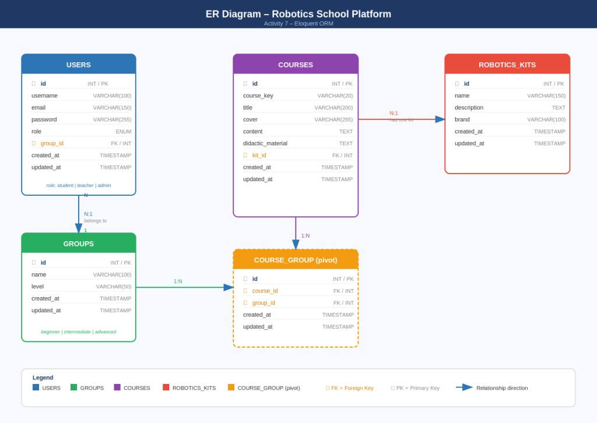

# Activity 7 – Robotics School Platform

## Project Name

**Activity 7 – Robotics School Platform**

---

## Project Description

This project is a web platform built with **Laravel 7** and **Eloquent ORM**, developed for a small robotics school. The system allows teachers to manage courses, groups, and students. All users (students, teachers and administrators) have an account on the platform and can interact with the available courses.

### Key Features
- Role-based user management (student, teacher, administrative)
- Group assignment for students (beginner, intermediate, advanced)
- Course management with robotics kit association
- Many-to-many relationship between groups and courses
- 100 seeded fake courses for development/testing (via FakerPHP factory)

---

## ER Diagram



---

## Installation

```bash
# Clone the repository
git clone https://github.com/nox-sudo/activity7.git
cd activity7

# Install dependencies
composer install

# Copy environment file and configure DB
cp .env.example .env
# Edit .env: set DB_CONNECTION=mysql, DB_DATABASE=activity7, DB_USERNAME=root, DB_PASSWORD=

php artisan key:generate

# Create the MySQL database (if not exists). Example:
# mysql -u root -e "CREATE DATABASE IF NOT EXISTS activity7;"
# Or via Laravel Herd / your MySQL client.

# Run migrations and seeders
php artisan migrate
php artisan db:seed
```

**Nota:** Asegúrate de que MySQL esté en ejecución y que la base de datos `activity7` exista antes de ejecutar `migrate` y `db:seed`.

---

## Artisan Commands Used

```bash
# Models
php artisan make:model RoboticsKit -m
php artisan make:model Group -m
php artisan make:model Course -m

# Controllers
php artisan make:controller RoboticsKitController --resource
php artisan make:controller GroupController --resource
php artisan make:controller CourseController --resource
php artisan make:controller UserController --resource

# Seeders
php artisan make:seeder UserSeeder
php artisan make:seeder RoboticsKitSeeder
php artisan make:seeder GroupSeeder

# Factory
php artisan make:factory CourseFactory --model=Course

# Run migrations
php artisan migrate

# Run seeders
php artisan db:seed
```

---

## Database Structure

| Table          | Description                              |
|----------------|------------------------------------------|
| users          | Platform users with roles                |
| groups         | Student groups by level                  |
| courses        | Courses offered on the platform          |
| robotics_kits  | Kits associated with each course         |
| course_group   | Pivot table (many-to-many)               |

---

## Tech Stack

- PHP 7.4+
- Laravel 7
- MySQL 8
- Eloquent ORM
- FakerPHP (for factories)
